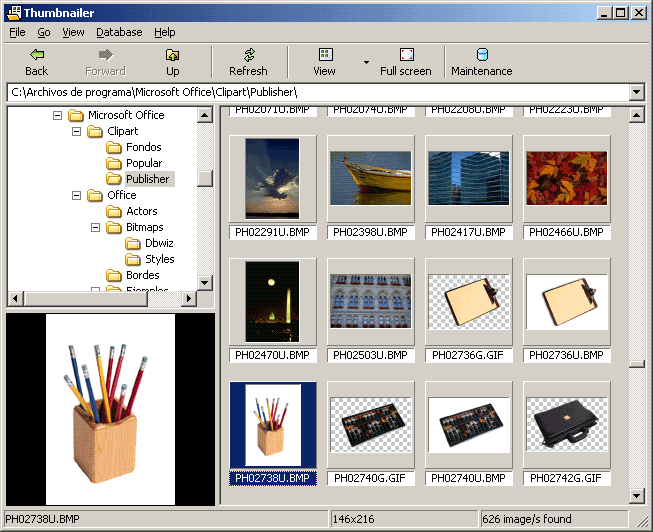



## Thumbnailer 1\.0 \(image thumbnailer\-viewer with GDI\+\)

### Description

A little note... The big issue of this work has been multithreading: thumbnails extraction should run independently. Despite of speed GDI+ extracts thumbnails, working with not so 'quick' devices can slow down all this, causing an 'awkward' navigation through folders. Also, application termination is still deficient: you can end up with an still running instance in case closing application during thumbnails extraction (see task manager). Nevertheless, I've finaly decided to post this work hoping it could be useful for someone. // Suggestions-solutions will be welcome (mainly, regarding to application termination), thanks. // 170Kb. // gdiplus.dll needed!.
 
### More Info
 

             |
---                |---
**Submitted On**   |2005-03-05 12:08:28
**By**             |[Carles P\.V\.](https://github.com/Planet-Source-Code/PSCIndex/blob/master/ByAuthor/carles-p-v.md)
**Level**          |Intermediate
**User Rating**    |4.9 (84 globes from 17 users)
**Compatibility**  |VB 6\.0
**Category**       |[Complete Applications](https://github.com/Planet-Source-Code/PSCIndex/blob/master/ByCategory/complete-applications__1-27.md)
**World**          |[Visual Basic](https://github.com/Planet-Source-Code/PSCIndex/blob/master/ByWorld/visual-basic.md)
**Archive File**   |[Thumbnaile1868763272005\.zip](https://github.com/Planet-Source-Code/carles-p-v-thumbnailer-1-0-image-thumbnailer-viewer-with-gdi__1-59677/archive/master.zip)

